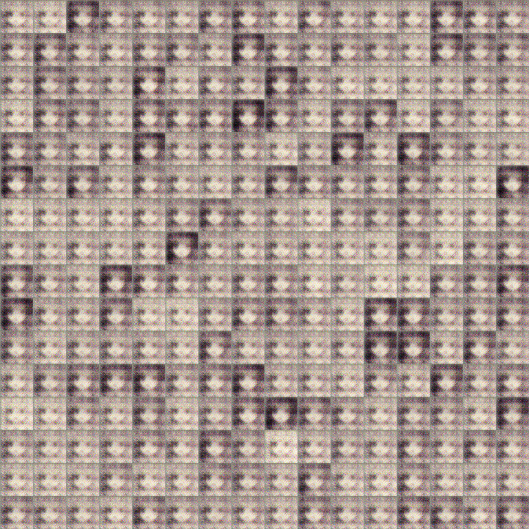
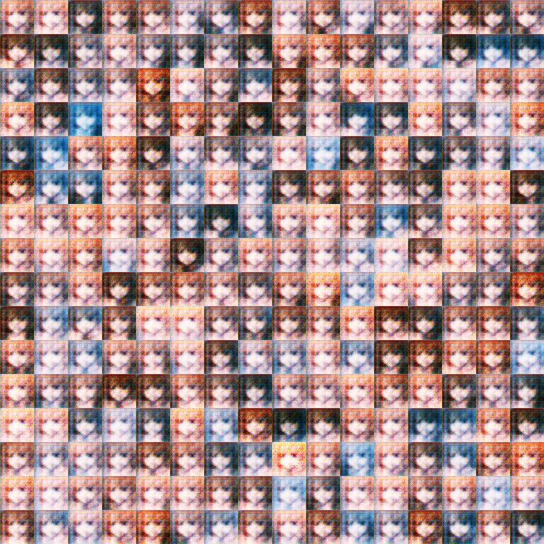
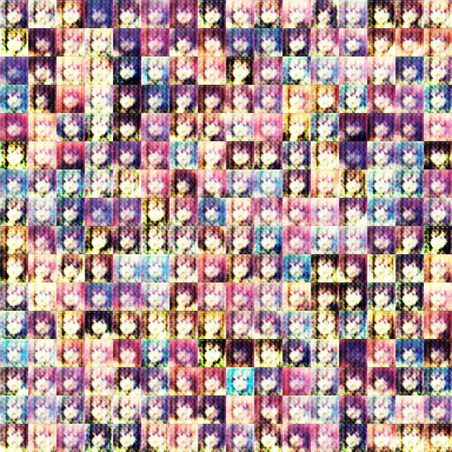
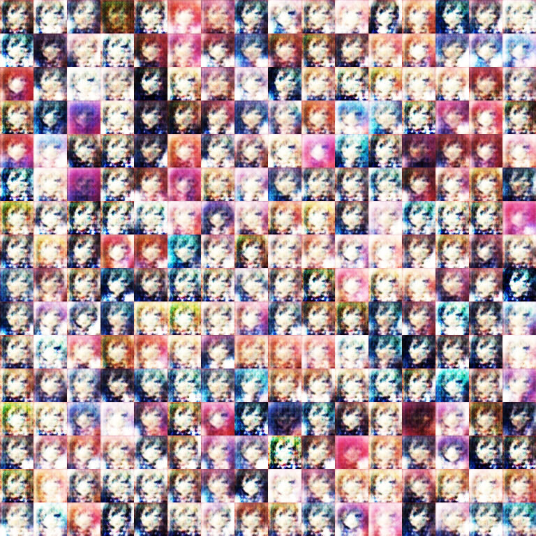
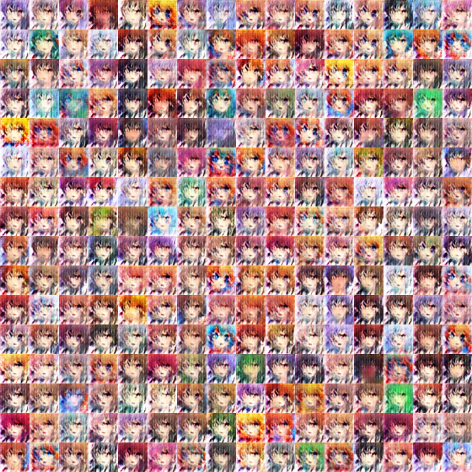
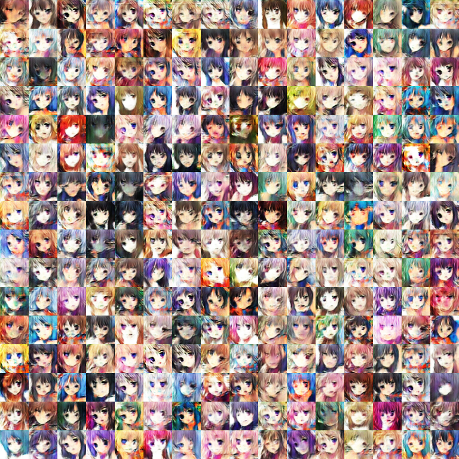
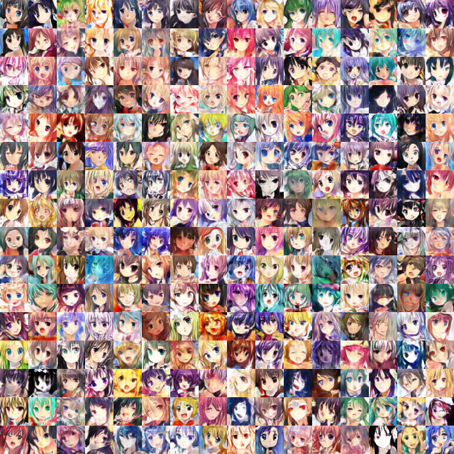
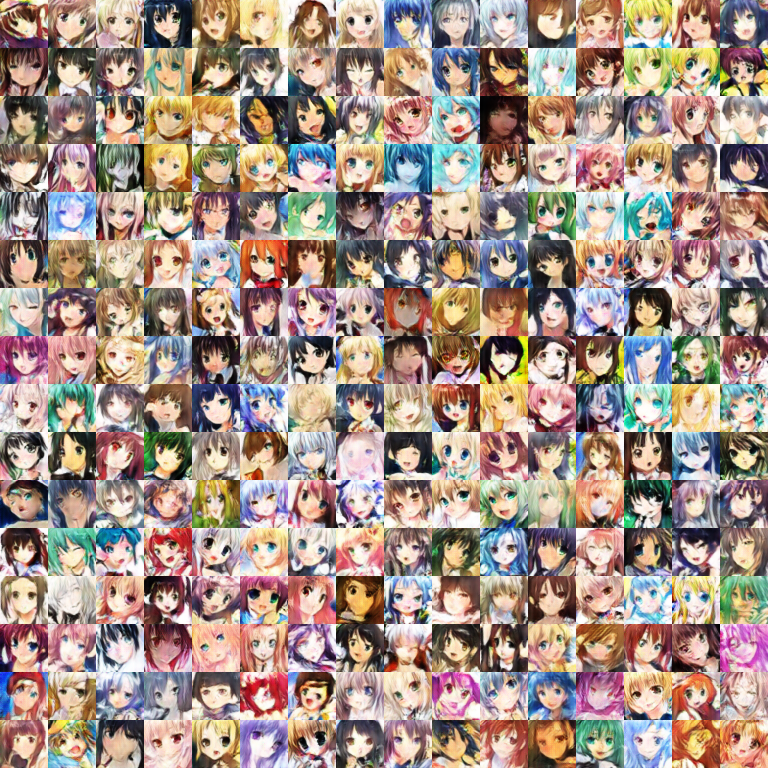

# Deep convolutional Generative Adversarial Nets

# Requirements:    
   python3.5(2.7) + tensroflow(>1.0) 

# File describe    
   download.py: download datasets like mnist, lsun, celebA    
   crawl_avatar.py: crawl avatar    
   crop_avatar.py: crop avatar to suitable size
   main.py: main function    
   model.py: model and training define    
   ops.py: definesome useful operations about network structures     
   utils.py: efine some useful util    
   dcgan_keras.py: dcgan code wrote by keras   
   lbpcascade_animeface.xml: The configuration file of cropping avatar
   data/*: dataset     
   checkpoint/*: model after about 1000000 iterations    
   samples/*: training and testing results

# Parameters   
   "epoch": "Epoch to train [25]"    
   "learning_rate": "Learning rate of for adam [0.0002]"     
   "beta1": "Momentum term of adam [0.5]"    
   "train_size": "The size of train images [np.inf]"     
   "batch_size": "The size of batch images [64]"     
   "input_height": "The size of image to use (will be center cropped). [108]"     
   "input_width": "The size of image to use (will be center cropped). If None, same value as input_height [None]"      
   "output_height": "The size of the output images to produce [64]"     
   "output_width": "The size of the output images to produce. If None, same value as output_height [None]"     
   "dataset": "The name of dataset [celebA, mnist, lsun]"    
   "input_fname_pattern": "Glob pattern of filename of input images [*]"     
   "checkpoint_dir": "Directory name to save the checkpoints [checkpoint]"     
   "sample_dir": "Directory name to save the image samples [samples]"     
   "train": "True for training, False for testing [False]"     
   "crop": "True for center cropping first, then resize the images [False]"     
   "visualize": "True for visualizing, False for nothing [False]"         

# Train step:    
   python main.py --epoch 3000 --batch_size 256 --input_height 96 --output_height 48 --dataset faces --train True --crop True      

# Testing step:    
   python main.py --batch_size 256 --input_height 96 --output_height 48 --dataset faces --crop True       
   half a epoch
       
   one epoch         
        
   five epoches  
       
   ten epoches         
     
   twenty-five epoches    
   
   fifty epoches       
       
   one hundred epoches      
    
   two hundred epoches   
       
   three hundred and twenty-one epoches 
      

# Reference:    
   https://github.com/yangxue0827/DCGAN-tensorflow    
   (make some small changes in source code to fix the problem when we want to test):   
   problem1: Modify the 94-97th lines of code in model.py     
   problem2: Modify the range of noise of the function visualize in utils.py