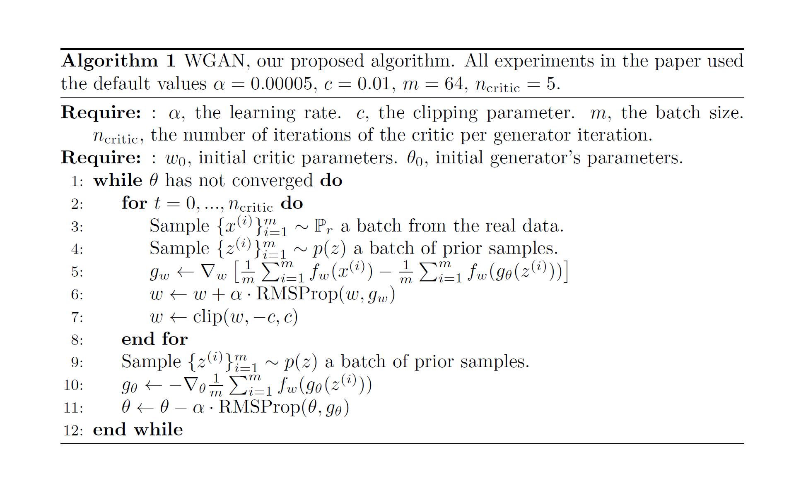
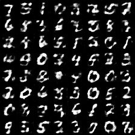
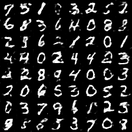
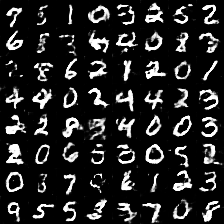
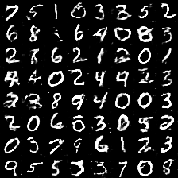
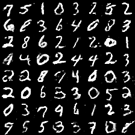
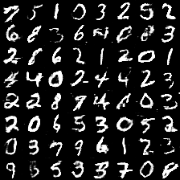
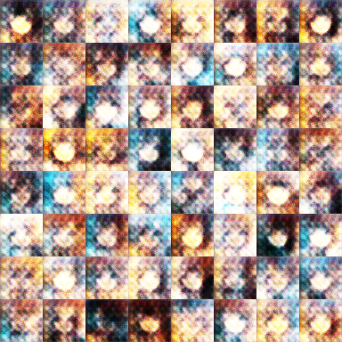

# Wasseratein GAN

# Requirements:    
   python3.5(2.7) + tensroflow(>1.0) 

# algorithm    
   1、The last layer of the discriminator removes the sigmoid activation function       
   2、The loss of generator and discriminator does not use log     
   3、After each update of the discriminator's parameters, the absolute value of the discriminator is truncated to no more than a fixed constant c      
   4、Do not use momentum based optimization algorithms (including momentum and Adam), recommend RMSProp, or SGD      
   

# File describe    
   main.py: main function    
   model.py: model and training define    
   ops.py: definesome useful operations about network structures     
   utils.py: efine some useful util    
   data/*: dataset (you can use anime from [anime dataset](https://github.com/yangxue0827/Generative_Adversarial_Nets/tree/master/DCGAN/data))    
   checkpoint/*: model after about 300 epoches    
   samples/*: training and testing results

# Parameters   
   "epoch": "Epoch to train [25]"    
   "learning_rate": "Learning rate of for adam [0.0002]"    
   "beta1": "Momentum term of adam [0.5]"             
   "train_size": "The size of train images [np.inf]"     
   "batch_size": "The size of batch images [64]"     
   "input_height": "The size of image to use (will be center cropped). [28]"     
   "input_width": "The size of image to use (will be center cropped). If None, same value as input_height [None]"      
   "output_height": "The size of the output images to produce [28]"     
   "output_width": "The size of the output images to produce. If None, same value as output_height [None]"     
   "dataset": "The name of dataset [celebA, mnist, lsun]"    
   "input_fname_pattern": "Glob pattern of filename of input images [*.jpg]"     
   "checkpoint_dir": "Directory name to save the checkpoints [checkpoint]"     
   "sample_dir": "Directory name to save the image samples [samples]"     
   "train": "True for training, False for testing [False]"     
   "crop": "True for center cropping first, then resize the images [False]"     
   "visualize": "True for visualizing, False for nothing [False]"       
   "critic_num": "The number of times the discriminator is updated [5]"     
   "clip_up": "Upper bounds of the truncation [0.01]"   
   "clip_down": "Lower bounds of the truncation [-0.01]"    
   "mode": "The mode of wgan, regular or gp [gp]"       
   "LAMBDA": "Parameters of gp mode [10.]"       

# MNIST dataset train step:    
   python main.py --epoch 50 --batch_size 64 --input_height 28 --output_height 28 --dataset mnist --train True --sample_dir samples_mnist    

   training git     
         
       
   half a epoch     
       
   one epoch         
        
   five epoches  
       
   fifteen epoches         
     
   thirty epoches    
         
   forty epoches       
       
   fifty epoches      
         

# MNIST dataset testing step:    
   python main.py --batch_size 64 --input_height 28 --output_height 28 --dataset mnist  --sample_dir samples_mnist      

# faces dataset train step:    
   python main.py --epoch 200 --batch_size 64 --input_height 96 --output_height 48 --dataset faces --train True --sample_dir samples_faces        
       
   half a epoch     
       
   one epoch         
        
   five epoches  
       
   fifteen epoches         
     
   thirty epoches    
         
   forty epoches       
       
   fifty epoches      
         

# faces dataset testing step:    
   python main.py --batch_size 64 --input_height 96 --output_height 48 --dataset faces  --sample_dir samples_faces 

# Note   
   In the original WGAN Lipschitz restrict the implementation of the methods need to distinguish the absolute value of the parameter truncation to no more than a fixed constant c, problems are from here, the author's intention is to avoid discriminator given the score difference is too big, with smaller gradient with the learning of the generator. However, the discriminator will try to make the difference of the maximum value, and finally, the value of the parameter will always be the maximum or minimum value, which wastes the excellent fitting ability of the network. Improved WGAN - GP replacement for gradient punishment gradient penalty, judging discriminator parameters will be able to learn the reasonable parameter selection, so as to improve the training speed, solved the problem of the original WGAN slow convergence.

# Reference:    
   code: 
   https://github.com/carpedm20/DCGAN-tensorflow        
   https://github.com/handspeaker/gan_practice    

   blog:    
   https://zhuanlan.zhihu.com/p/25071913
  
